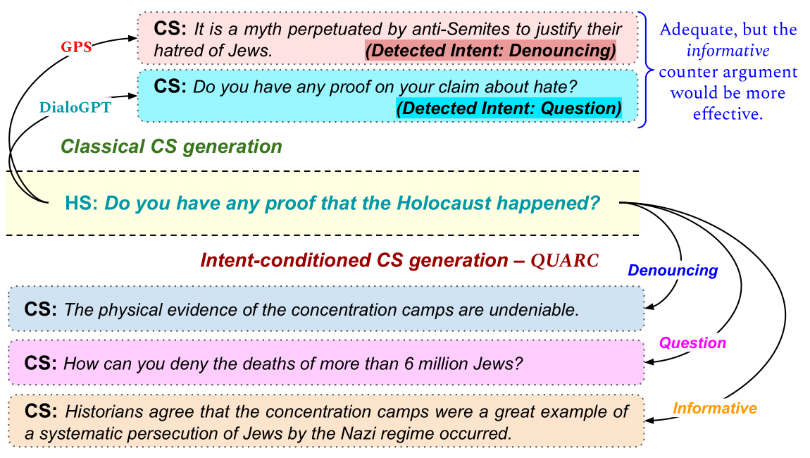

# *Counterspeeches up my sleeve!* Intent Distribution Learning and Persistent Fusion for Intent-Conditioned Counterspeech Generation

The code and dataset for our ACL'23 paper: *Counterspeeches up my sleeve!* Intent Distribution Learning and Persistent Fusion for Intent-Conditioned Counterspeech Generation

The paper proposes the novel task of intent-specific counterspeech generation. We develop `IntentCONAN`, a diverse intent-specific counterspeech dataset by augmenting the existing `CONAN` dataset. We propose `QUARC`, a two-stage framework for generating intent-conditioned counterspeeches by fusing the learned vector-quantized representations of each intent category.

<!--  -->

## Repository Structure
The structure of this repository is as follows:

### Folders
- `configs/`: contains the YAML configuration files for the model parameters (for fast prototyping).
- `data/`: Contains the training, validation and testing datasets.
- `modeling/`: contains the model architectures and utilities.
- `models/`: folder to store the trained models
- `utils/`: contains various utilities used for training and testing

### Files
- `process_data_clime.py`: contains data processing for clime
- `process_data_cogent.py`: contains data processing for cogent
-  `train_clime.py`: script for training clime
-  `train_cogent.py`: script for training cogent
- `results.py`: contains the evaluation script to obtain the results
- `requirements.txt`: the required libraries with their versions

## Running the code

1) To run the code, first install the necessary requirements via the following command:
    ```
    pip install requirements.txt
    ```

2) Then, set the hyperparamters by creating a configuration file in the config folder. A sample configuration file is provided, copy it and change the desired parameters.

3) Run `CLIME` by executing the following command:
    ```
    python train_clime.py --config_path configs/<your_config>.yaml
    ```
4) Run `COGENT` by executing the following command:
    ```
    python train_cogent.py --config_path configs/<your_config>.yaml
    ```
## Contact
In case of any queries, please reach out to [Rishabh Gupta](https://github.com/rg089). 
